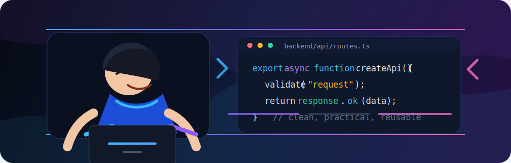

### Clean backend systems, practical APIs, and developer-friendly tools

 

Subtle anime-inspired coding vibe with production-minded backend engineering.

  

---

## About Me

I am a Backend Developer focused on building clean, maintainable, and practical backend systems.

- I work with RESTful APIs, validation, authentication, database design, and logging
- I create reusable backend utilities, CLI tools, and npm packages
- I enjoy building developer-friendly tools that help other developers work faster
- I am continuously improving my backend engineering skills
- I like practical backend solutions that are simple, reliable, and easy to maintain

My backend experience includes building modules for a School Management System, including Dashboard, Survey, Class, Assignment, Quiz, Staff Management, Student Management, and E-learning.

---

## Tech Stack

### Languages

### Backend

### API & Backend Concepts

### Database

### Tools

---

## Featured Projects / npm Packages

### api-core-backend

Backend API utilities for REST API response handling, pagination, filtering, search, HTTP status, and Express middleware helpers.

---

### khmer-chhankitek-calendar

A Khmer calendar functionality package for working with Khmer date and calendar logic.

---

### init-backend-project

A CLI tool for generating clean and practical backend project structures.

---

## What I Am Currently Building / Learning

- Better backend architecture
- Clean API design
- TypeScript backend tooling
- CLI and scaffolding tools
- Reusable developer utilities
- Open-source npm packages

---

## GitHub Stats

 
 

 
 

---

## Connect With Me

- GitHub: [https://github.com/chochkimhour](https://github.com/chochkimhour)
- npm: [https://www.npmjs.com/~chochkimhour](https://www.npmjs.com/~chochkimhour)
- LinkedIn: [https://www.linkedin.com/in/choch-kimhour](https://www.linkedin.com/in/choch-kimhour)
- Email: `chochkimhour2303@gmail.com`

---

## License

This profile README project is licensed under the [MIT License](LICENSE).

Copyright (c) 2026 Choch Kimhour.

---
