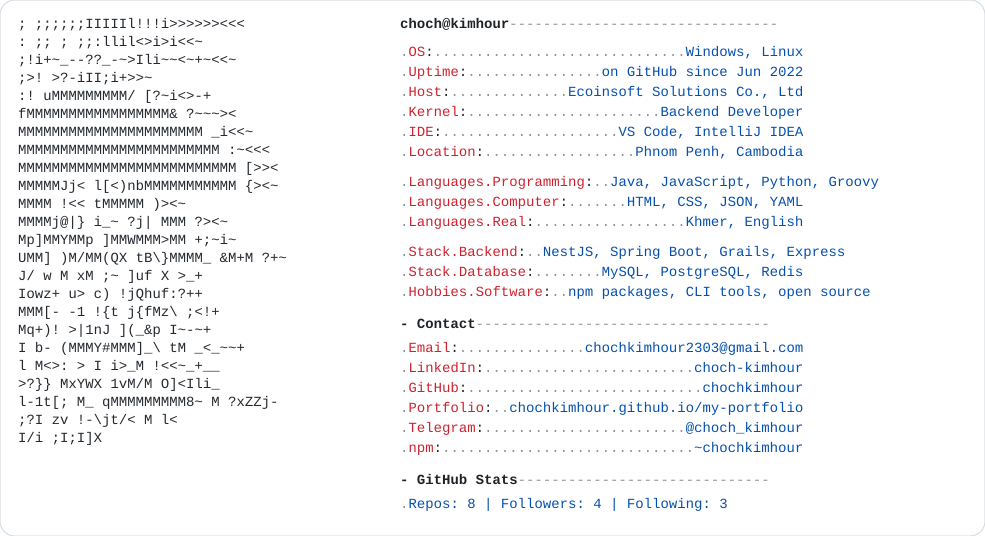

<!--
  GitHub profile README — Andrew6rant-style neofetch SVG
  ASCII source: assets/choch_kimhour.txt
  Regenerate SVG: npm run generate:svg
  Regenerate README: npm run generate
-->

<a href="https://github.com/chochkimhour">
  <picture>
    <source media="(prefers-color-scheme: dark)" srcset="assets/dark_mode.svg" />
    
  </picture>
</a>

### Links

- **LinkedIn:** [linkedin.com/in/choch-kimhour](https://www.linkedin.com/in/choch-kimhour)
- **Portfolio:** [chochkimhour.github.io/my-portfolio](https://chochkimhour.github.io/my-portfolio)
- **npm:** [npmjs.com/~chochkimhour](https://www.npmjs.com/~chochkimhour)
