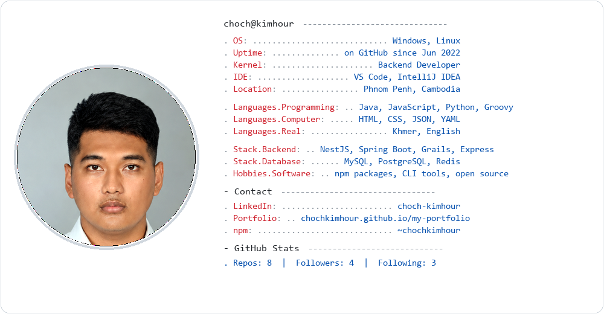

<!--
  GitHub profile README — neofetch card with real portrait photo.
  Regenerate: npm run generate:all
-->

<a href="{{GITHUB_URL}}">
  <picture>
    <source media="(prefers-color-scheme: dark)" srcset="assets/dark_mode.png" />
    
  </picture>
</a>
